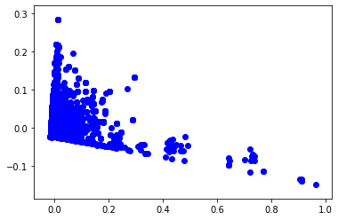
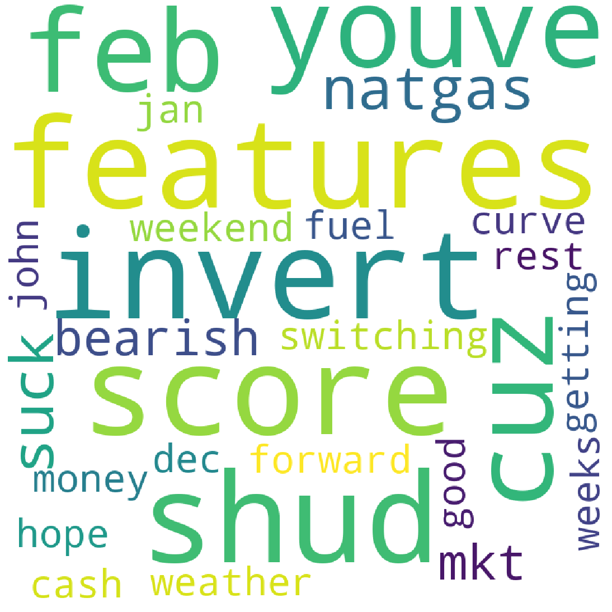
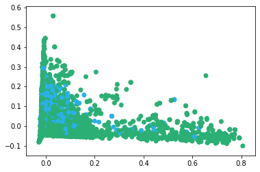
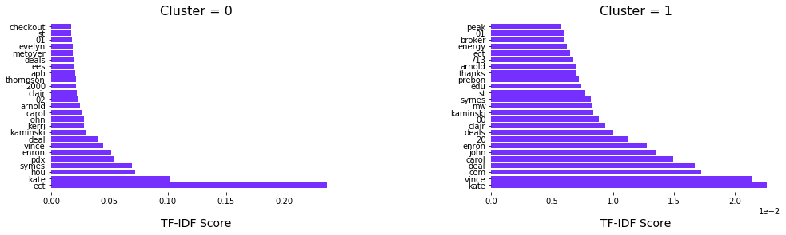
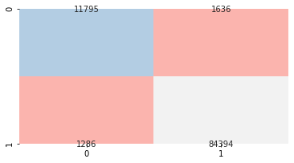
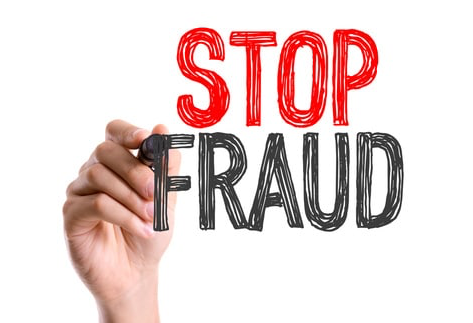

# Email-Fraud-Detection
Utilizing the Enron Emails to create a Fraud Detection model.

## Why does this matter?
Enron was one of the largest energy companies in the world before it's collapse in 2001.  Not only was it the largest bankruptcy in American history at the time, it also dragged Arthur Anderson,  one of the 5 largest accountancy/audit firms, down with it.  The effects of this gigantic risk management failure are still being felt in the financial and energy markets nearly 2 decades later.  

The board was generally ignorant of what was going on at Enron, and both the guilty CEOs Ken Lay and Jeff Skilling, charmed and bullied the board and their underlings into accepting things the way they were without question.  Culture issues aside, the Enron case had a number of classic fraud 'red flags' that would have indicated something was up years before the collapse.  

Using the case as a study and example of the magnificant way some companeis can fail would benefit us in the future.  We can learn from the mistakes of the past, and better utilize the current resources to find these failures at an early stage.  Ultimately we set out to create a machine learning model that would detect individuals who may need the additional scrutiny of an analyst to review, the email sender as engaging in possible fraud.  Using AI as a first line of defense frees up the resources of the analysts to focus on investigating _warm leads_ or freeing up the human capital resources for use elsewhere in the organization.

## Source Data
The dataset we are reviewing is the remaining body of corporate emails mostly between 1997-2001. The remaining body contains data from about 150 users, mostly senior management of Enron, and contains over 500k individual emails. This data was originally made public, by the Federal Energy Regulatory Commission during its investigation. You can find the source data here:  https://www.cs.cmu.edu/~enron/

For readability and ease of use, the project is organized into four parts.  The reader is recommended to follow the notebooks in order.

## Natural Language Processing
Using the library Parser to loop over the whole dataset inside local directories appending each email section to a list and concatenating further into a dataframe.  Most of the time spent working with the data was cleaning and scrubbing emails.  In terms of text, they are particularly messy.  

### Exploring
I moved on to exploratory analysis using some plots from NXViz, which is a visualization library that sits on top of NetworkX.  I created 3 visualizations, an Arc plot, a Circos plot, and a Network map, for looking at the shape and density of a network using the whole dataset.  
<<<<<<< HEAD

Given the above complexity, these plots didn't really let me see anything particularly useful except that the dimensionality of the problem is so complex, even a network map was insufficient.  We took a slice of the heaviest 1,000 edges and created the below plot instead.

Given the above complexity, these plots didn't really let me see anything particularly useful except that the dimensionality of the problem is so complex, even a network map was insufficient.  We took a slice of the heaviest 1,000 edges and created the below plot instead.

At the center of the second map, is one of the head traders for Enron, specializing in Natural Gas.  Less than a week before the bankruptcy was declared he earned the single highest bonus ever to be paid to a single trader at Enron; some $8mm+.  Individuals with that much influence are often considered to be high risk for fraud; simply, the number of connections in the organization makes it easy to hide activity or for the individuals to exert influence where there may be a conflict on interest, both enabling fraud.  

I was able to use NLTK to create frequency distributions for the common words used in the whole dataset. Even from something simple as this can show, visually that something was going on.  Using this distribution, I was able to create a wordcloud to cleary display my findings.  

I have spent over a decade in corporate finance and from personal expereince, the word 'problems' is not one people use in emails in a healthy organization.The __kathy__ who is front and center of the cloud was implicated in the Enron scandal, over $200,000 was clawed back from her personal bank accounts for her participation in fraudlent deals.  

### Model Prep
To utilize any machine learning models on the data, the email bodies had to be converted to vectors for processing.  I chose a TF-IDF vectorization which incorporates the fact that some words are used more frequently regardless of the text body they appear in.  

Below is a visualization that represents the vectors created.  We will revisit this visualization later once the clustering is processed.  

Another useful step is to force the vectors back into words and use the scores to order the most common words.  After doing that, the below wordcloud is created.  

## Machine Learning

### Unsupervised Learning - K-Means Clustering 
The goal here is hopefully to sort everything into sections, people and important words. I'll use these later on as labels in a supervised learning task.  Note here that I needed to create a dense matrix from an extremely large sparse matrix.  Numpy simply won't do it on the size of the data I have.  I took the largest slices of the matrix that both my personal computer and the kaggle remote server I used could handle.  

K-means is a clustering algorithm that aims to partition the data into _k_ clusters. These clusters are organized by separating each observation and linking it to the _cluster_ with the nearest mean.

I'll actually use the mini-batch Kmeans algorithm from sklearn. This way I won't read the whole dataset into memory at the same time. Given the data size that I'm working with, this will save quite a bit of computational efficiency.  I initalized the algorithm with 2 clusters, a batch size of 500, and ran 100 iterations.

This is a great oppoirtunity to review the same scatter plot we used before, though this time color coding the clusters.

You can see that the clustering algorithm did a fair job separating the important things from the nonsense.  One can extrapolate that given the computing power to run the whole dataset that it would do even better.

Here's a clear visual of the top words ranked by TF-IDF score for each cluster.  These were well done and I was comfortable using the results as the __true__ labels in the supervised learning task.

### Supervised Learning - K-Nearest Neighbors
As a classification algorithm, K-nearest neighbors, produces a result that is a class 'membership'. The words are classified by a vote of its neighbors, with the word being assigned to the class most common among its k nearest neighbors (k is a positive integer, typically small). Additionally, KNN is a lazy learning algorithm, where the function is only approximated locally and all computation is deferred until classification, a desirable feature for a dataset so large.

I split the data into a training set and test set then initialized using 3 nearest neighbors.  The overall accuracy was over 97% and I included a section of classification report and the confusion matrix below.  

    accuracy                           0.97     99111
   macro avg       0.94      0.93      0.94     99111
weighted avg       0.97      0.97      0.97     99111

## Conclusion and Implications
This means the model can be used as an efficient method to review email's in order to find people worth investigating.
The Kmeans algorithm separated the email body into people and words. These people who were say in the top 20, were all implicated in some way during the Enron scandal in 2001. Then to make our future selves more efficient we took those clusters, called them 'true' labels in the KNN algorithm and used that to look at the words. With over 97% accuracy we were able to classify these words as important or not.

A business should be able to take new emails and find people who might be worth a second look using the model.  The application in Fraud and Risk management is very clear.  A company can use a trained algorithm like this to find the people who may be at risk of committing fraud.  It could be that the person is really in a central position and has access to a large amount of sensitive data, it could also be the person is a 'deal executor' and has significant power over the bottomline.  Whatever the reason, if an algorithm pair like this suggests a person is worth reviewing the next step would be to have a fraud analyst do a more in depth investigation.  The machine learning is great first step and frees up business resources for other activities, but it does not eliminate the need for human intervention.

## If I had more time...

I could further our work in a number of ways.  First, I could find the necessary resources to be able to run the algorithm on the full dataset.  Second, I could break our clustering and classifying into two steps: find the people of interest and then going on to look at the language they used in their emails to see if that could be a red flag for fraud in itself.  Finally, I could try a number of different clusters or neighbors to see if I could further improve model performance.