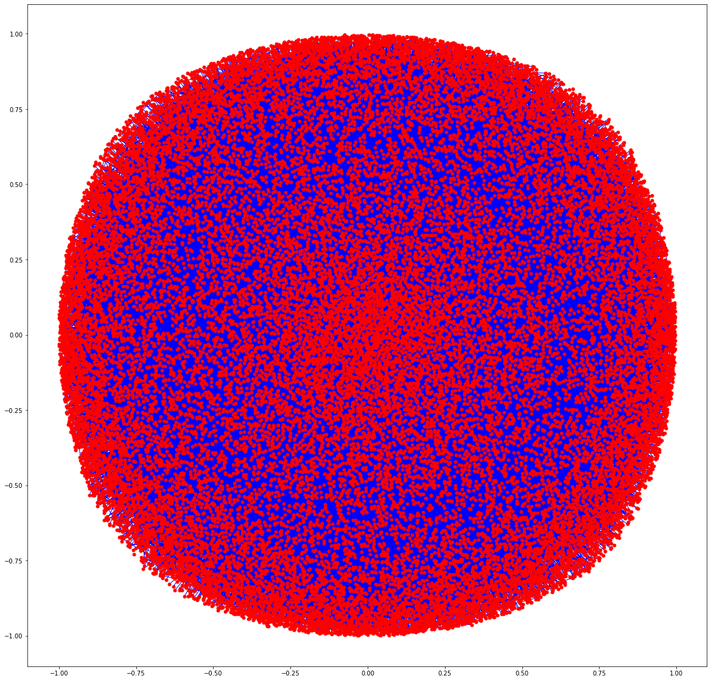

# Email-Fraud-Detection
Utilizing the Enron Emails to create a Fraud Detection model.

## Why does this matter?
Enron was one of the largest energy companies in the world before it's collapse in 2001.  Not only was it the largest bankruptcy in American history at the time, it also dragged Arthur Anderson,  one of the 5 largest accountancy/audit firms, down with it.  The effects of this gigantic risk management failure are still being felt in the financial and energy markets nearly 2 decades later.  

The board was generally ignorant of what was going on at Enron, and both the guilty CEOs Ken Lay and Jeff Skilling, charmed and bullied the board and their underlings into accepting things the way they were without question.  Culture issues aside, the Enron case had a number of classic fraud 'red flags' that would have indicated something was up years before the collapse.  

Using the case as a study and example of the magnificant way some companeis can fail would benefit us in the future.  We can learn from the mistakes of the past, and better utilize the current resources to find these failures at an early stage.  Ultimately we set out to create a machine learning model that would detect individuals who may need the additional scrutiny of an analyst to review, the email sender as engaging in possible fraud.  Using AI as a first line of defense frees up the resources of the analysts to focus on investigating _warm leads_ or freeing up the human capital resources for use elsewhere in the organization.

## Source Data
The dataset we are reviewing is the remaining body of corporate emails mostly between 1997-2001. The remaining body contains data from about 150 users, mostly senior management of Enron, and contains over 500k individual emails. This data was originally made public, by the Federal Energy Regulatory Commission during its investigation. You can find the source data here:  https://www.cs.cmu.edu/~enron/

## Natural Language Processing
Using the library Parser to loop over the whole dataset inside local directories appending each email section to a list and concatenating further into a dataframe.  Most of the time spent working with the data was cleaning and scrubbing emails.  In terms of text, they are particularly messy.  

### Exploring
I moved on to exploratory analysis using some plots from NXViz, which is a visualization library that sits on top of NetworkX.  I created 3 visualizations, an Arc plot, a Circos plot, and a Network map, for looking at the shape and density of a network using the whole dataset.  

Given the above complexity, these plots didn't really let me see anything particularly useful except that the dimensionality of the problem is so complex, even a network map was insufficient.  We took a slice of the heaviest 1,000 edges and created the below plot instead.

At the center of the second map, is one of the head traders for Enron, specializing in Natural Gas.  Less than a week before the bankruptcy was declared he earned the single highest bonus ever to be paid to a single trader at Enron; some $8mm+.  Individuals with that much influence are often considered to be high risk for fraud; simply, the number of connections in the organization makes it easy to hide activity or for the individuals to exert influence where there may be a conflict on interest, both enabling fraud.  

I was able to use NLTK to create frequency distributions for the common words used in the whole dataset. Even from something simple as this can show, visually that something was going on.  Using this distribution, I was able to create a wordcloud to cleary display my findings.  

I have spent over a decade in corporate finance and from personal expereince, the word 'problems' is not one people use in emails in a healthy organization.The __kathy__ who is front and center of the cloud was implicated in the Enron scandal, over $200,000 was clawed back from her personal bank accounts for her participation in fraudlent deals.  

### Model Prep
To utilize any machine learning models on the data, the email bodies had to be converted to vectors for processing.  I chose a TF-IDF vectorization which incorporates the fact that some words are used more frequently regardless of the text body they appear in.  

